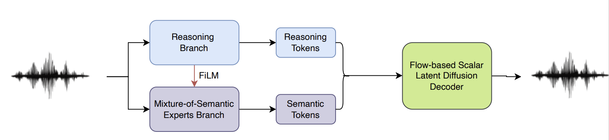

## ReasoningCodec: Descriptive and Structural Semantic Tokenization for Audio Language Modeling



## Abstract

Designing audio tokens that align with the inductive biases of language models is crucial for building unified audio language models capable of both understanding and generation. Previous works show that semantic tokens are easily modeling than acoustic tokens in the LM paradigm. But existing semantic token approaches often treat semantics narrowly as transcript-level content, overlooking other essential aspects of audio such as prosody and melody that are inherently semantic but not easily represented in text.
In this work, we propose **ReasoningCodec**, a universal semantic tokenizer that explicitly decomposes audio semantics into two complementary types. (1) Descriptive semantics: high-level, human-interpretable attributes (e.g., linguistic content, emotion, style) that can be expressed in natural language and are thus well-aligned with pre-trained language model; and structural semantics: fine-grained, frame-level dependencies (e.g., phonetic continuity, prosodic pattern) that are difficult to verbalize but crucial for faithful signal reconstruction.

To realize this target, we design a hierarchical and multiple experts tokenization strategy. To capture the descriptive semantics, we use a query-based quantization method to compress the audio into an extremely low frame-rate (e.g., 5Hz) semantic representation. To make sure these tokens capture the descriptive semantic information, we introduce audio understanding tasks as the supervision with the help of pre-trained LLM. Specifically, we first use a lot of audio uuderstanding tasks to conduct the supervised fine-tuning (SFT). Then we introduce reinforcement learning (GRPO) to encourage the LLM to predict the detailed reasoning analysis for the audio, which covers the fine-grained description for audio. After SFT and GRPO training, these tokens effectively capture the descriptive semantics. 

For the structural semantics, we use three pre-trained audio encoder as the experts: a wavlm encoder is used to extract the phone-level semantic feature, a music SSL encoder is used to extract the music-structure semantic feature, a whisper encoder is used to extract the sound semantic feature. These three audio experts are fixed, we design two strategies to quantize these features. During the training stage, we only update the quantizer and the decoder. Furthermore, we also introduce descriptive semantic-condition to reduce redundancy between descriptive semantic and structural semantic token streams. Lastly, we adopt a flow-based Scalar Latent Diffusion as the decoder to improve the reconstruction performance.

When used in an audio language model, descriptive tokens are placed before structural semantic tokens in the sequence, allowing the model to first generate high-level semantics reasoning before completing the full acoustic detail—while still being trained in a single unified stage. Experiments show that ReasoningCodec yields more interpretable, LLM-friendly tokens and improves performance on both audio understanding and generation tasks.


## How to use?

### Download the checkpoints

```bash
huggingface-cli download Dongchao/ReasoningCodec \
  --local-dir ./ReasoningCodec \
  --repo-type model
```

### set the audio folder path
```bash
bash infer.sh
```

## How to train the model

Note that the ReasoningCodec is trained by three stages:
(1) AudioThinking model training (including the SFT and GRPO)
(2) Pre-training the semantic tokenizer on recontruction tasks
(3) Fine-tuning the AudioThinking and semantic tokenizer as the final ReasoningCodec

The fulling training recipes will be released in the future.

The details of the training configuration can be found on our reasearch paper.

