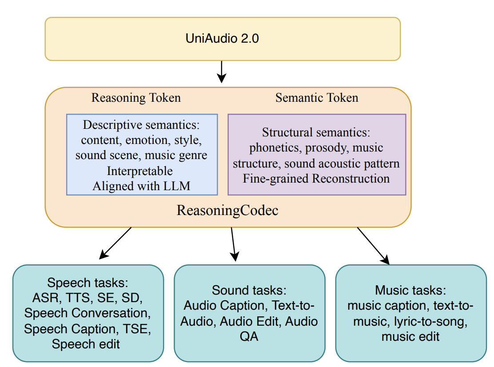

# UniAudio 2.0: A Multi-task Audio Foundation Model with Reasoning-Augmented Audio Tokenization




## Abstract

In this work, we present UniAudio 2.0, a multi-task audio foundation model that unifies speech, sound, and music understanding and generation within a single framework. A key component of UniAudio 2.0 is our proposed ReasoningCodec, which tokenizes audio into reasoning tokens and semantic tokens. Reasoning tokens capture descriptive, interpretable attributes (e.g., linguistic content, emotion, style, acoustic scene), while semantic tokens encode structural and fine-grained acoustic details necessary for faithful reconstruction.
For generation tasks, UniAudio 2.0 adopts a reasoning-first prediction strategy: the model first predicts reasoning tokens, providing human-interpretable descriptions that enhance interpretability and predictive accuracy, and then generates semantic tokens to synthesize high-fidelity audio. This design enables UniAudio 2.0 to move beyond transcription-centric modeling, incorporating paralinguistic information (emotion, timbre, tone), environmental context, and non-linguistic sounds, which are often neglected in prior text–audio foundation models.
By integrating ReasoningCodec into a unified audio foundation model, UniAudio 2.0 establishes a comprehensive framework for multi-domain audio tasks. Experimental results show that UniAudio 2.0 improves both understanding and generation across diverse modalities, advancing the goal of general-purpose audio foundation models.

## Planing

The whole project is ongoing. Now, you can use the **ReasoningCodec**! The training details of UniAudio 2.0, please refer to our research paper.

- [x] Release the training code and the checkpoints of ReasoningCodec
- [ ] Release the research paper of UniAudio 2.0
- [ ] Release the checkpoints of UniAudio 2.0


## Environment
```bash
conda create -n uniaudio2 python=3.10
pip install pip==24.0
pip install fairseq==0.12.2
pip install torch==2.4.1
pip install torchaudio==2.4.1
pip install torchtitan==0.0.2
pip install langsegment==0.3.5
pip install typeguard==2.13.3
pip install lightning==2.4.0
pip install nnAudio==0.3.3
pip install omegaconf==2.0.6
pip install torchtune==0.4.0
pip install torchao==0.9.0
pip install tensorboard
pip install humanfriendly
```


